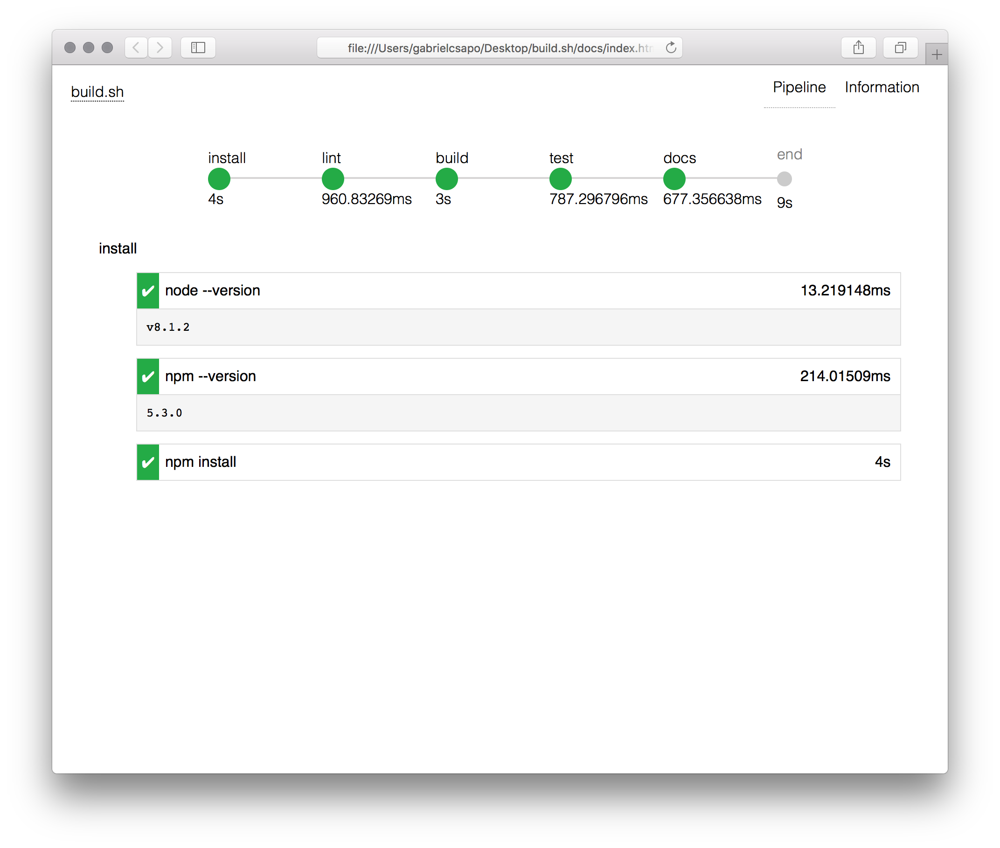

# build.sh

> 🔨 run and visualize the build process

<!-- TOC depthFrom:2 depthTo:6 withLinks:1 updateOnSave:1 orderedList:0 -->

- [Installation](#installation)
- [Usage](#usage)

<!-- /TOC -->

## Installation

```
npm install build.sh -g
```

## Usage

> commit a `build.yml` file to your project root

```
pipeline:
  {key}:
    - {command}
    - {command}
```

To invoke about the pipeline simply run `build` at the project root.

The terminal output will show the pipeline being run and eventually will open the browser to the location of the final report.

This build pipeline:

```yaml
output: ./docs
pipeline:
  install:
    - npm --version
    - node --version
    - npm install
  lint:
    - npm run lint
  build:
    - npm run coverage
  test:
    - npm test
  docs:
    - npm run generate-docs
```

Will yield the following results:



Sometimes things go as planned and certain build phases will fail and that will yield:


An important factor when dealing with build pipelines is the persistence of environment variables and git information which is recorded and accessible via the `Information` tab:


