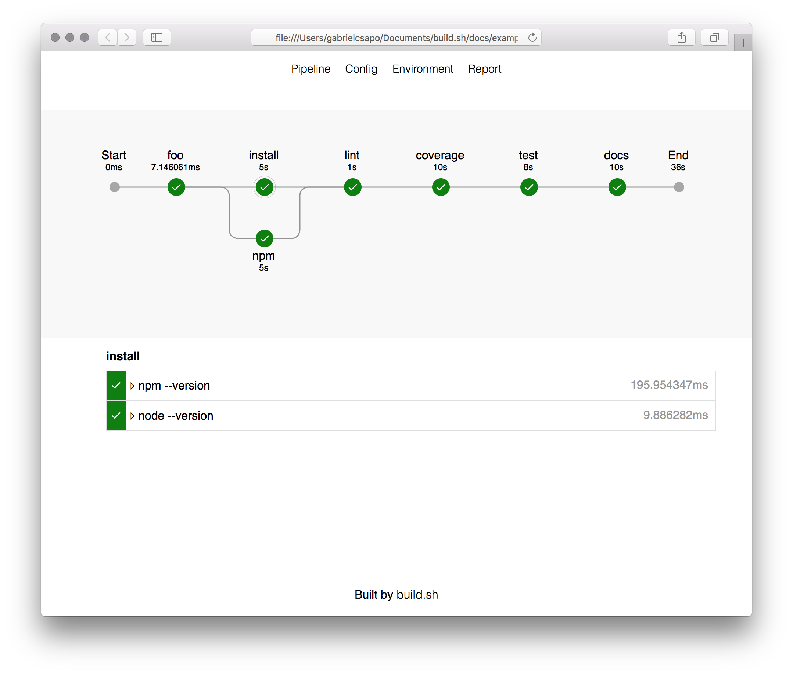

# build.sh

> 🔨 run and visualize the build process



## Getting started

> For more docs please visit <https://gabrielcsapo.github.io/build.sh/>

### Installation

```bash
npm install build.sh -g
```

### Setup

Add a build.yml file to your repo

```yaml
env:
  - {key}={value}
pipeline:
  {key}:
    - {command}
    - {command}
```

### Run

Run `build` in your repo and wait for the output

```
 ┬ build         ┬ ─ ┬ test         ┬ ─  ┬ docs                        ┬ ─
 ├ npm run build ┤   ├ npm run test ┤    └ cd website && npm run build ┘
 └ npm run lint  ┘   └ npm run pack ┘
```
